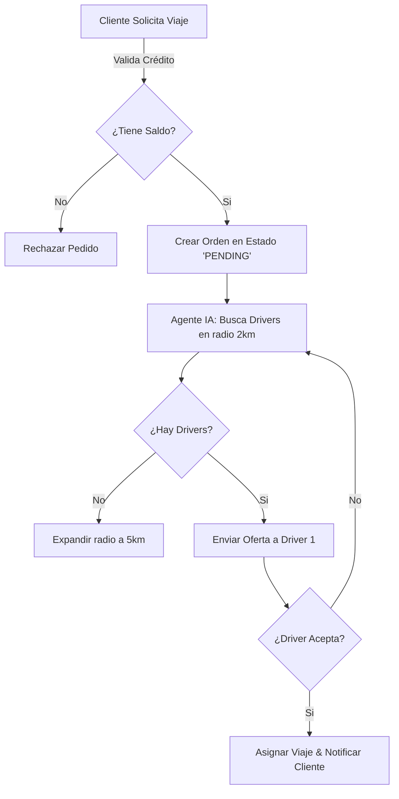

# TALLER DE LÓGICA Y FLUJOS (WORKFLOWS)
## Aprendiendo a Pensar como el Sistema

Los flujogramas son el puente entre tu "Visión de Negocio" y mi "Código". No necesitas dibujar cajitas en Visio; podemos hacer **Pseudo-código** o **Mermaid Diagrams** (texto que se convierte en gráfico).

### EJERCICIO 1: El Ciclo de Vida de un Viaje
Analicemos la lógica detrás de un pedido en Teso.

#### Tu Visión (Lenguaje Natural):
"El cliente pide un carro, el sistema busca al conductor más cercano, si acepta se asigna, si no, busca a otro."

#### Nivel Arquitecto (Flujo Lógico Estructurado):

### ¿Por qué sirve esto?
Si tú me das este flujo (incluso escrito en texto), yo no tengo dudas. 
- Sé que tengo que validar saldo (`B`).
- Sé que tengo que hacer un loop de búsqueda (`E` -> `F` -> `G`).

### Tu Turno:
Describe un proceso que quieras clarificar (ej: "Pagar a un conductor" o "Facturar a una empresa") y lo convertiremos juntos en un Flujo Lógico.
