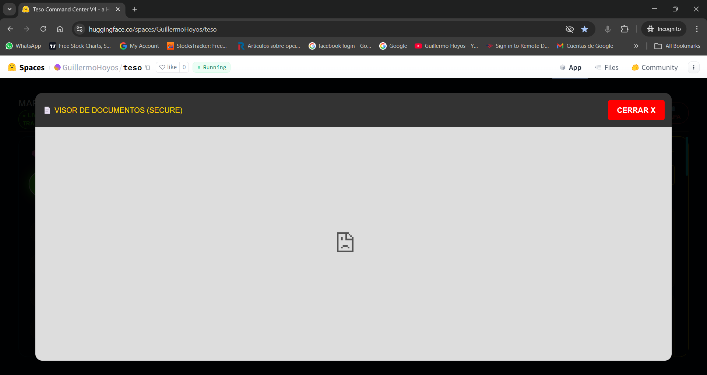

# AGENTIC AI BLUEPRINT: FROM PROMPT TO AUTONOMY
> **Artifacto de Estudio - Preparación Clase GPT Agents**
> *Objetivo: Entender y diseñar arquitecturas agénticas avanzadas usando modelos GPT.*

## 1. ¿Qué define a la "IA Agéntica"? (The Agency Loop)
A diferencia de un Chatbot normal (Input -> Output), un Agente tiene un **Bucle de Control**:
1.  **PERCEPTION (Ver):** Recibe el estado del entorno (ej. base de datos, saldo banco, mensaje usuario).
2.  **BRAIN (Pensar):** El LLM (GPT-4) no solo responde, sino que **razona** un plan.
3.  **TOOLS (Actuar):** Tiene "manos" (API Calls, Python Code, Web Search) para ejecutar acciones.
4.  **FEEDBACK (Observar):** Ve el resultado de su acción y decide si terminó o necesita corregir.

---

## 2. Arquitectura "ReAct" (Reasoning + Acting)
Este es el estándar de oro que estudiarás hoy.
*Prompt del Sistema (System Prompt):*
> "Eres un experto financiero. Tienes acceso a una calculadora y a la base de datos SQL.
> PREGUNTA: ¿Es la empresa rentable hoy?
> 
> PENSAMIENTO 1: Necesito saber los ingresos y gastos de hoy. Buscaré en la DB.
> ACCIÓN 1: `query_sql('SELECT * FROM sales WHERE date = today')`
> OBSERVACIÓN 1: Ingresos = $1000. Gastos = Desconocido.
> PENSAMIENTO 2: Me faltan los gastos. Buscaré en la tabla de costos.
> ACCIÓN 2: `query_sql('SELECT * FROM costs')`
> ..."

**Diferencia Clave:** El modelo **habla consigo mismo** antes de responderte.

---

## 3. Niveles de Automatización en GPTs
Para tu clase, distingue estos 3 niveles:

### Nivel 1: The Advisor (Como nuestro FinancialAgent actual)
*   **Input:** Datos fijos (JSON).
*   **Process:** Analiza con un Prompt.
*   **Output:** Texto/Recomendación.
*   *Limitación:* No puede buscar más info por su cuenta.

### Nivel 2: The Tool User (Function Calling)
*   **Input:** Objetivo vago ("Mejorar rentabilidad").
*   **Process:** El GPT decide qué función llamar (`get_financials()`, `send_email_support()`).
*   **Output:** Ejecuta la función y te reporta.

### Nivel 3: The Validated Agent (OODA Loop - Observe, Orient, Decide, Act)
*   **Capacidad:** Auto-corrección.
*   *Ejemplo:* Intenta pagar una nómina -> Falla por fondos -> **Decide** transferir de ahorros -> Reintenta pago -> Éxito -> Reporta.

---

## 4. Diseño de un "TESO GPT" (Caso de Uso Real)
Cómo aplicaríamos esto en tu proyecto TESO Core:

**Rol:** `Dispatch_Orchestrator_GPT`
**Herramientas (Tools) a darle:**
1.  `get_fleet_status()`: Ver dónde están los carros.
2.  `assign_route(drive_id, route_id)`: Asignar viaje.
3.  `voice_broadcast(msg, emotion)`: Hablar por el radio (Tu VoiceSystem).

**Script de Comportamiento (System Prompt):**
```markdown
Eres el Jefe de Operaciones de TESO. Tu misión es maximizar la eficiencia de la flota.
REGLAS:
1. Nunca asignes viajes a conductores cansadors (>8 horas).
2. Si llueve (usa `get_weather`), reduce la velocidad promedio.
3. Si hay un VIP (Bancolombia), asígnale un "Conductor Estrella".
```

---

## 5. Glosario para la Clase
*   **Context Window:** La memoria a corto plazo del agente.
*   **System Message:** La personalidad inmutable y reglas.
*   **Temperature:** Creatividad (0 = Robot preciso, 1 = Poeta loco). Para Finanzas u Ops, usa 0.1.
*   **Chain of Thought (CoT):** Pedirle al modelo "Piensa paso a paso" para mejorar la lógica.

---

> **Nota para el Usuario:** Este documento está diseñado para ser impreso o leído como "Cheat Sheet" durante tu clase.
